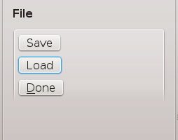

.. _segmentation-tool-user:

=================
Segmentation Tool
=================

Overview
========

The segmentation tool is a tool designed to be used to digitise a set of images.  It offers a number of tools to assist the user in digitising their images including a novel feature that allows the digitising plane to be oriented into any orientation thus allowing the user to choose the best view of the image's features as possible.  Other features include undo/redo functionality, saving the current segmentation and loading a saved segmentation.

Layout
======

The segmentation tool is comprised of two parts the toolboxes to the left hand side and the segmentation area to the right.  The toolboxes offer enhancements to the available tools more information can be found in the `Toolboxes`_ section.  The segmentation area is comprised of two tabs a 3D view of the segmentation scene and a 2D view of the segmentation scene.  The two views can also be laid out side-by-side if desired by dragging either of the tabs to the drop zone near the right hand side of the window.  The drop zone is not visible but it will show itself (highlights itself with a blue background) when a tab is dragged over it.

Input
=====

The segmentation tool takes in a set of images and visualises them in a 3D texture.    The texture's size is determined from the images that have been loaded, for image formats such as DICOM there is often scaling information embedded with the image data.  If this is the case then the scale information will be used by the tool to correctly scale and position the image texture.  All images in the stack are assumed to have the same dimensions thus the width and height of the texture is set to the width and height of the first image.  The depth of the texture is determined from the number of images in the stack.

Functionality
=============

The segmentation step features helpful tools to speed up the process of creating segmented data.  One such feature is undo/redo support, a must have for correcting mistakes.  In this section each of the four tools that are currently available are covered as well as information on how the view can be manipulated. 

Manipulating the 3D View
------------------------
The 3D view can be manipulated with the mouse in the following maner.
Left-mouse:	The left mouse button will rotate the view.
Right-mouse:	The right mouse button will zoom the view, this type of zoom is a fly zoom where the view point moves towards the interest point.  Pressing the shift key when using the right mouse button will employ a telephoto style zoom, this type of zoom is synonomous with a zoom lens on a camera.
Middle-mouse:	The middle mouse button will translate the view (on OS X translation is achieved by holding down the command key whilst pressing the left mouse button).

Manipulating the 2D View
------------------------

The 2D view can be manipulated with the mouse in the following maner.
Left-mouse:	The left mouse button will rotate the view in the plane.
Right-mouse:	The right mouse button will zoom the view in the same manner as for manipulating the 3D view.
Middle-mouse:	The middle mouse button will translate the view (on OS X translation is achieved by holding down the command key whilst pressing the left mouse button).
These manipulations hold to some degree independent of the tool currently in use.  A particular tool may override these operations to perform operations appropriate for itself, see the tool's section for further details on what mouse operations are overriden.

Point Tool
----------

The point tool is the tool for adding single segmentation points onto the current image plane.  To add a single point press the Ctrl key and the left mouse button when the cursor is pointing to the desired location on the image plane.  Existing points can be selected and moved by clicking directly on an existing segmentation point.  The segmentation point will follow the mouse pointer while the mouse button is pressed.  Using the shift key and the left mouse button it is possible to select a group of segmentation points.  This can be done by either individually clicking on all the segmentation points to be selected or clicking and dragging the mouse to create a rubber-band selection box in which all segmentation points will be automatically selected.  Note that only segmentation points will be selected and not curve points while the point tool is active.  You can activate this tool with the keyboard shortcut Ctrl-1. 

See the `Point Toolbox`_ section for details on the options that this tool can make use of.

Curve Tool
----------

The curve tool is a tool for adding multiple segmentation points at a time.  This tool places interpolated Bezier points between user placed control points.  The user can place control points using the Ctrl key and the left mouse button, the curve will update while the mouse is moving to offer a preview of what the curve will look like with the addition of the next control point.  To finish placing control points press the Ctrl key and the right mouse button.  Existing control points can be selected and moved by clicking directly on an existing control point.  The control point will follow the mouse pointer and the curve will update it's shape while the mouse button is pressed.  The interpolated Bezier points are not able to be selected or moved directly.  You can activate this tool with the keyboard shortcut Ctrl-2. 

See the `Curve Toolbox`_ section for details on the options that this tool can make use of.

Normal Tool
-----------

The normal tool is used for moving the image plane in the direction of the image plane normal.  Use the left mouse button to click on the arrow and with the left mouse button held down drag the plane to the desired location.  When clicked the arrow will change colour to orange to indicate that it has been selected.

You can activate this tool with the keyboard shortcut Ctrl-3. 

Rotation Tool
-------------

The rotation tool is used for re-oreinting the image plane around a rotation point.  The centre of rotation for the plane is indicated by the purple sphere, if you want to change the point of rotation use the left mouse button and click on the sphere.  While the mouse button is held down the sphere will follow the mouse movements.  Release the mouse and the plane can now be rotated around the new rotation point.  When clicked the sphere will change colour to red to indicate that it has been selected.

You can activate this tool with the keyboard shortcut Ctrl-4. 
  
Toolboxes
=========

This section describes the toolboxes available in the segmentation tool.

File Toolbox
------------

   
   **Figure 1**: File toolbox.

The file toolbox consists of three buttons.  The three buttons are:

#. Save button.
#. Load button.
#. Done button.

The save button is for saving the current session to disk.  The load button is for loading a previous session from disk and the done button is to signal to the workflow that the step has finished and it should continue execution.

View Toolbox
------------

The view toolbox controls the visibility of the graphical items in the view.  The view toolbox allows the user to set the visibility of:

#. The image plane.
#. The image stack outline
#. The coordinate labels

Image Toolbox
-------------

The image toolbox displays information on the image stack currently in use as well as the scaling and offset currently being applied.  The image properties shows the dimensions of the 3D texture without any scaling.  The scaling edit boxes show the scaling to be applied the default values are 1.0, 1.0, and 1.0.  The offset edit boxes show the offset to be applied the default values are 0.0, 0.0, and 0.0.

It is advisable to set the scaling and offset of the image stack before starting the segmentation process.  

Point Toolbox
-------------

The point toolbox controls four options for the point tool.  The four options are:

#. Point size.
#. Create mode.
#. Push/Pull.
#. Delete.

The point size option controls the size of the segmentation points that are seen in the 2D and 3D scene.  The create mode option either enables or disables streaming create.  With streaming create enabled pressing the Ctrl key and the left mouse button and then moving the mouse (with the left mouse button still pressed) will leave a trial of segmentation points.  When streaming create is disabled this same action would create a single segmentation point that would follow the movement of the mouse.  The Push/Pull option can be used to make a copy of the currently selected segmentation points and raise or lower them in the direction of the image plane normal the specified distance in the step size spin box.  The Push direction is opposite to that of the plane normal while the Pull direction is the same as that of the plane normal.  The delete option will delete the currently selected segmentation points.

Curve Toolbox
-------------

The curve toolbox controls four options for the curve tool.  The four options are:

#. Point size.
#. Interpolation point count.
#. Push/Pull.
#. Delete.

The point size option controls the size of the curve points that are seen in the 2D and 3D scene.  The interpolation point count sets the number of Bezier interpolation points that appear between the curve control points.  The Push/Pull option can be used to make a copy of the currently selected curves and raise or lower them in the direction of the image plane normal the specified distance in the step size spin box.  The Push direction is opposite to that of the plane normal while the Pull direction is the same as that of the plane normal.  Note that only whole curves can be pushed and pulled.  The delete option will delete the currently selected curves.

Output
======

When the segmentation is finished the coordinates of all the segmented points is given as a list of lists (Python lists).

